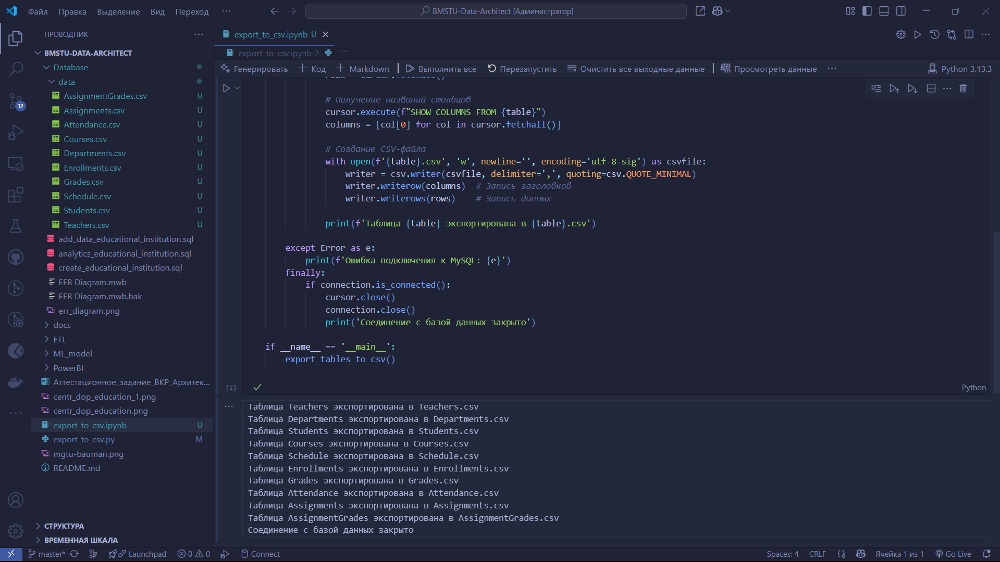

# Выпускная квалификационная работа "Архитектор данных"


## Описание репозитория

**Архитектор данных** — это специалист, который проектирует, создаёт и управляет структурами данных организации, обеспечивая их эффективное хранение, обработку, интеграцию и безопасность.

Он разрабатывает стратегии работы с данными, определяет стандарты, выбирает подходящие технологии (например, базы данных, облачные решения) и создаёт архитектурные модели, которые соответствуют бизнес-целям компании.

Его задачи включают оптимизацию данных для анализа, обеспечение масштабируемости систем и соблюдение регуляторных требований (например, `GDPR`).

`Архитектор данных работает на стыке бизнес-анализа`, `ИТ-инфраструктуры` и `Data Science`

**Центр дополнительного образования МГТУ им. Баумана** — это `подразделение Московского государственного технического университета`, которое предлагает программы профессиональной переподготовки, повышения квалификации и краткосрочные курсы для широкой аудитории: от студентов и выпускников до действующих специалистов и корпоративных заказчиков.

Центр фокусируется на технических, инженерных, IT-направлениях (например, `Data Science`, `робототехника`, `цифровые технологии`), а также на `управленческих` и `бизнес-дисциплинах`

`Обучение здесь строится на базе научно-технической экспертизы МГТУ, с привлечением преподавателей-практиков и использованием современных образовательных методик`

`Цель центра` — помочь слушателям актуализировать знания, освоить новые компетенции и адаптироваться к изменениям на рынке труда.

### Структура репозитория

```textline
BMSTU-DATA-ARCHITECT/  
├── ETL/                 # Скрипты ETL-процессов  
├── ML_model/            # Код ML-модели и датасеты  
├── Database/            # SQL-скрипты и ER-диаграммы  
├── PowerBI/             # Файлы Power BI (.pbix)  
├── docs/                # Пояснительная записка, презентация  
└── README.md            # Описание проекта, инструкции  
```

### Глоссарий

```textline
1. Основные термины:

1.1) ETL-процесс (Extract, Transform, Load)
Процесс извлечения данных из источников, их преобразования (очистка, нормализация) и загрузки в хранилище (DWH).

1.2) DWH (Data Warehouse)
Централизованное хранилище данных, оптимизированное для аналитики и отчетности.

1.3) ML-модель (Machine Learning Model)
Алгоритм, обученный на исторических данных для прогнозирования событий (например, риска отчисления студентов).

1.4) LMS (Learning Management System)
Система управления обучением (например, Moodle, Google Classroom), используемая для организации учебного процесса.

1.5) ERD (Entity-Relationship Diagram)
Диаграмма сущностей и связей, визуализирующая структуру базы данных.

2. Технологии и инструменты:

2.1) Apache Airflow
Платформа для оркестрации ETL-пайплайнов.

2.2) Power BI
Инструмент для создания интерактивных дашбордов и визуализации данных.

2.3) MySQL Workbench
Среда для проектирования и администрирования реляционных баз данных.

2.4) XGBoost
Библиотека градиентного бустинга, применяемая для задач классификации и регрессии.

2.5) GitHub
Платформа для хранения и совместной разработки кода.

3. Образовательная аналитика:

3.1) Персонализация обучения
Адаптация учебных материалов под индивидуальные потребности студента.

3.2) Прогнозная аналитика
Использование данных и ML для предсказания будущих событий (например, успеваемости).

3.3) Академическая успеваемость
Показатели студента: оценки, посещаемость, активность в LMS.

3.4) Риск отчисления
Вероятность прекращения студентом обучения, рассчитанная ML-моделью.

3.5) Дашборд (Dashboard)
Интерактивный интерфейс для визуализации ключевых метрик (например, успеваемости групп).

4. Метрики качества:

4.1) Точность (Accuracy)

4.2) AUC-ROC
Площадь под ROC-кривой, оценивающая качество классификации (диапазон: 0.5–1.0).

4.3) Гармоническое среднее точности и полноты (F1-Score)

5. Примеры использования терминов:

5.1) ETL-процесс использован для загрузки данных из LMS в DWH.

5.2) ML-модель на основе XGBoost достигла AUC-ROC = 0.92.

5.3) В Power BI создан дашборд для анализа академической успеваемости.

```

### Видео демонстрация

Вы можете посмотреть видео демонстрацию проекта по [этой ссылке](https://github.com/QuadDarv1ne/BMSTU-Data-Architect/blob/master/add_data_on_project.mp4).

#### Загрузка в репозиторий

`Git LFS` — это расширение для `Git`, которое позволяет эффективно управлять большими файлами, такими как видео, графические файлы, бинарные файлы и другие крупные данные, которые обычно не подходят для управления версиями в стандартном репозитории `Git`

# Команды Git LFS

| Команда | Описание |
|---------|----------|
| `git lfs env` | Показать окружение LFS |
| `git lfs status` | Проверить состояние файлов |
| `git lfs pull` | Скачать LFS-файлы после `git pull` |
| `git lfs prune` | Удалить старые версии LFS-файлов |
| `git lfs locks` | Работа с блокировками (для бинарников) |

**Шаг №1: Установка Git LFS**

- Скачайте и установите `Git LFS` с [официального сайта](https://git-lfs.com/)
- `Убедитесь, что Git LFS установлен правильно, выполнив в командной строке:`

   ```bash
   git lfs install
   ```

**Шаг №2: Инициализация `Git LFS` в вашем репозитории**

- Перейдите в корневую директорию вашего репозитория.
- **Выполните команду для инициализации `Git LFS` в вашем репозитории:**

   ```bash
   git lfs install
   ```

**Шаг №3: Отслеживание больших файлов**

- Укажите `Git LFS` отслеживать ваш большой файл.
- **Например, если ваш файл называется `add_data_on_project.mp4`, выполните:**

   ```bash
   git lfs track "add_data_on_project.mp4"
   ```

   **Эта команда создаст или обновит файл .gitattributes, чтобы указать Git LFS на необходимость отслеживания указанного файла.**

**Шаг №4: Добавление и коммит изменений**

- **Добавьте файл `.gitattributes` и ваш большой файл в индекс:**

   ```bash
   git add .gitattributes
   git add add_data_on_project.mp4
   ```

- **Сделайте коммит изменений:**

   ```bash
   git commit -m "Add large file with Git LFS"
   ```

**Шаг 5: Отправка изменений в удаленный репозиторий**

- **Отправьте изменения в ваш удаленный репозиторий на GitHub:**

   ```bash
   git push origin master
   ```

Теперь ваш большой файл должен быть успешно загружен в репозиторий с использованием `Git LFS`

---

#### Экспорт данных в .csv формате



---

💼 **Автор:** Дуплей Максим Игоревич

📲 **Telegram:** @quadd4rv1n7

📅 **Дата:** 12.05.2025

▶️ **Версия 1.0**

```textline
※ Предложения по сотрудничеству можете присылать на почту ※
📧 maksimqwe42@mail.ru
```
